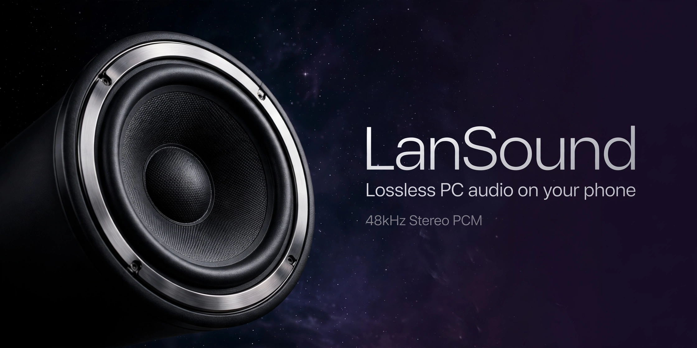
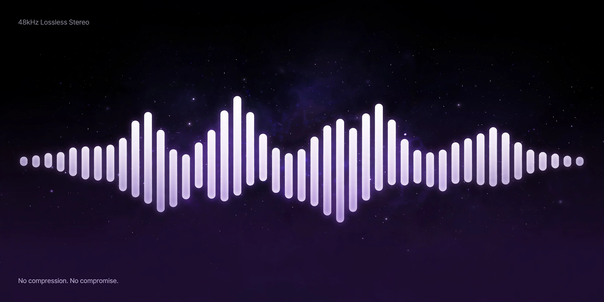
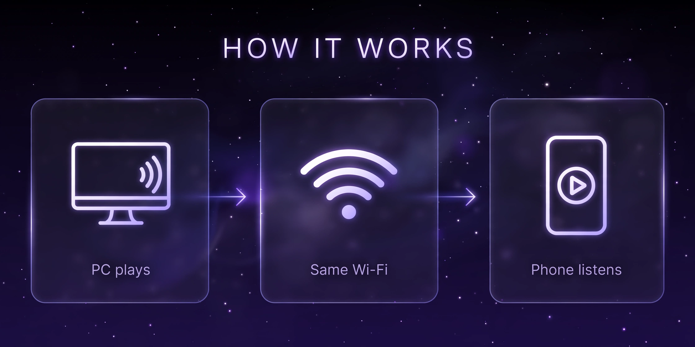

# 澜声 LanSound — 把电脑声音无损传到手机

[English](README_EN.md) | 中文



PC 与手机连同一局域网，手机扫码打开网页即可收听电脑正在播放的声音。
**为音质而做**：全链路 48kHz 立体声无损 PCM，不压缩、不降质。



## 为什么音质好

| 环节 | 做法 |
|---|---|
| 采集 | WASAPI 回环直取系统混音，不经过任何转码 |
| 码流 | 48kHz / 16bit / 立体声裸 PCM，20ms 一帧，WebSocket 二进制直传 |
| 重采样 | 设备不是 48kHz？左右声道**各自独立**重采样到 48kHz，立体声像完整保留，绝不降混成单声道 |
| 高音质档 | 200ms 抖动缓冲 + 750ms 时钟漂移重排上限，WiFi 抖动下优先不断音、不断续 |
| 验证 | 自带 `tools/probe-*` 音质探针：重采样时长守恒、音调保持、幅度无损、立体声零串扰，全部可实测 |

两档（高音质 / 低延迟）码流完全一样，差别只在"延迟 vs 抗抖动"的取舍——
高音质档把缓冲给足，听感优先；低延迟档把延迟压到 60ms 级。默认高音质。



## 快速开始

1. 解压 `LanSound-v1.0-win-x64.zip`（Windows 10 19041+，需 .NET 8 Desktop Runtime + Windows App Runtime）
2. 运行 `LanSound.exe`
3. 手机连同一 WiFi，扫码打开页面，点"开始收听"
4. 锁屏也能听，媒体键可控制

> 首次运行会自动生成本地根证书；手机浏览器遇到证书警告点"继续访问"即可，
> 或访问 `http://<电脑IP>:7444/ca.crt` 安装根证书。

## 项目结构

```
pc-app/        WinUI 3 桌面端（采集 + 信令 + 服务）
phone-web/     手机端网页（Web Audio 播放）
tools/         开发工具：音频排障探针、配色、打包脚本
docs/          协议文档
```

桌面端详细说明见 [pc-app/README.md](6ab490f622c4d5c0804ab1e0/pc-app/README.md)（构建、排障、已踩过的坑都在里面）。

## License

MIT
