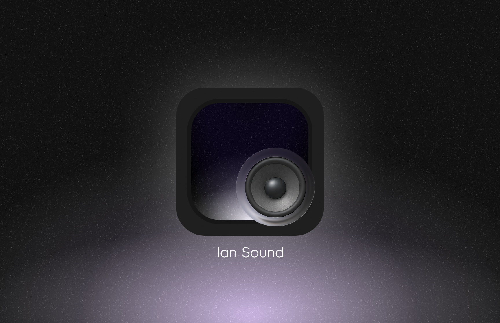

# LanSound — Stream Your PC Audio to Your Phone, Losslessly



PC and phone on the same LAN: scan the QR code on your phone and listen to whatever your PC is playing.
End-to-end 48kHz stereo lossless PCM. No compression, no degradation.

## Excellent sound quality

| Stage | How |
|---|---|
| Capture | WASAPI loopback grabs the system mix directly — no transcoding |
| Stream | 48kHz / 16-bit / stereo raw PCM, 20ms frames, sent as binary over WebSocket |
| High-quality mode | 200ms jitter buffer + 750ms clock-drift correction — dropouts stay away on shaky Wi-Fi |
| Verified | Built-in `tools/probe-*` audio probes: resampling duration conservation, pitch preservation, lossless amplitude, zero stereo crosstalk — all measurable |

Both modes (High quality / Low latency) carry the identical stream — the only difference is the latency-vs-robustness tradeoff.
High-quality mode gives the buffer room; low-latency mode cuts delay to ~60ms. High quality is the default.

## Quick start

1. Extract `LanSound-v1.0-win-x64.zip` (Windows 10 19041+, .NET 8 Desktop Runtime + Windows App Runtime required)
2. Run `LanSound.exe`
3. Phone on the same Wi-Fi: scan the code, tap "Start listening"
4. Works on lock screen; media keys control playback

> A local root CA is generated on first launch. Tap "Continue" on the browser certificate warning.

## Project layout

```
pc-app/        WinUI 3 desktop app (capture + signaling + server)
phone-web/     Phone web player (Web Audio)
tools/         Dev tools: audio probes, color tooling, packaging scripts
docs/          Protocol docs
```

## License

MIT
